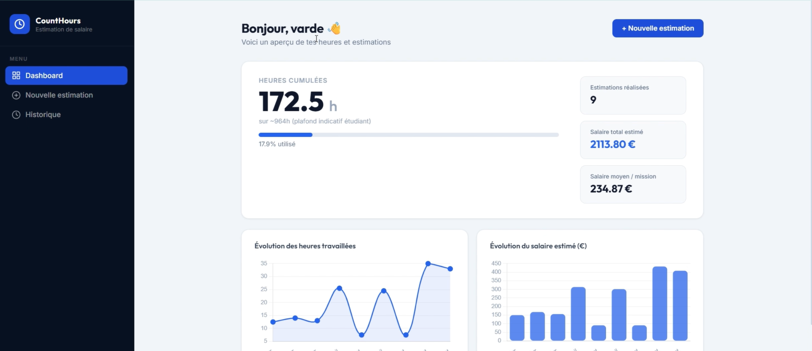

# CountHours — Estimation de salaire pour étudiants travailleurs

> Uploade ton contrat de travail, renseigne tes heures réelles, obtiens une estimation de ton salaire brut en quelques secondes.

🔗 **Démo live** : [varde11-count-hours-frontend.hf.space](https://varde11-count-hours-frontend.hf.space)

---

## Contexte

En tant qu'étudiant travailleur, compter ses heures et calculer son salaire brut est une tâche fastidieuse et source d'erreurs. CountHours automatise ce processus : l'IA extrait les informations clés de ton contrat PDF et calcule une estimation précise de ta rémunération.

---

## Fonctionnalités

- **Extraction IA** — Analyse automatique du contrat PDF (taux horaire, durée, règles de majoration) via LangGraph + Groq/Llama 3.3. Compatible PDF natif et PDF scanné (OCR via Tesseract)
- **Calcul du salaire** — Heures normales, supplémentaires (+25%, +50%), de nuit, du dimanche et jours fériés
- **Compteur d'heures cumulées** — Suivi du capital heures travaillées sur toutes les missions
- **Dashboard** — Graphiques d'évolution des heures et du salaire estimé
- **Historique** — Toutes les estimations passées avec détail du calcul
- **Authentification JWT** — Espace personnel sécurisé par token

---

## Stack technique

| Couche | Technologies |
|---|---|
| IA / Extraction | LangGraph, Groq (Llama 3.3-70b), pytesseract, PyMuPDF |
| Backend | FastAPI, SQLAlchemy, PostgreSQL, JWT |
| Frontend | React, Vite, CSS Modules, Chart.js |
| Déploiement | Docker, Docker Compose, HuggingFace Spaces, Render |

---

## Architecture
```
PDF Contrat
    │
    ▼
┌─────────────────────┐
│   extract_text_pdf  │  ◄── Extraction directe (PyMuPDF)
└─────────────────────┘
    │ texte vide ? (pdf scanné)
    ▼
┌─────────────────────┐
│  extract_text_ocr   │  ◄── OCR via Tesseract (PDF scanné)
└─────────────────────┘
    │
    ▼
┌─────────────────────┐
│  extract_snippets   │  ◄── Filtrage par mots-clés
└─────────────────────┘
    │
    ▼
┌─────────────────────┐
│     LLM Node        │  ◄── Groq / Llama 3.3
│  (LangGraph)        │
└─────────────────────┘
    │
    ▼
┌─────────────────────┐
│  SalaryEstimation   │  ◄── Calcul heures + montants
└─────────────────────┘
    │
    ▼
  Stockage des résultats dans la base de données
```


---

## Lancer le projet en local

### Prérequis
- Docker & Docker Compose
- Un compte [Groq](https://console.groq.com) pour la clé API

### Variables d'environnement
Crée un fichier `.env` à la racine :
```env
DATABASE_URL=postgresql://user:password@db:5432/counthours
GROQ_API_KEY=your_groq_key
SECRET_KEY=your_secret_key
ALGORITHM=HS256
ACCESS_TOKEN_EXPIRE_MINUTES=60
API_URL=http://localhost:8000
AUTHORIZED_URL= http://localhost:8501
```

### Démarrage
```bash
git clone https://github.com/varde11/hoursCountProjet
cd hoursCountProjet
docker compose up --build
```

L'application est accessible sur `http://localhost:8501`

---

## Auteur

**VARDE11** — Vannel Feukou
- LinkedIn : [vannel-evrard-feukou-noukatche90092](https://www.linkedin.com/in/vannel-evrard-feukou-noukatche90092)